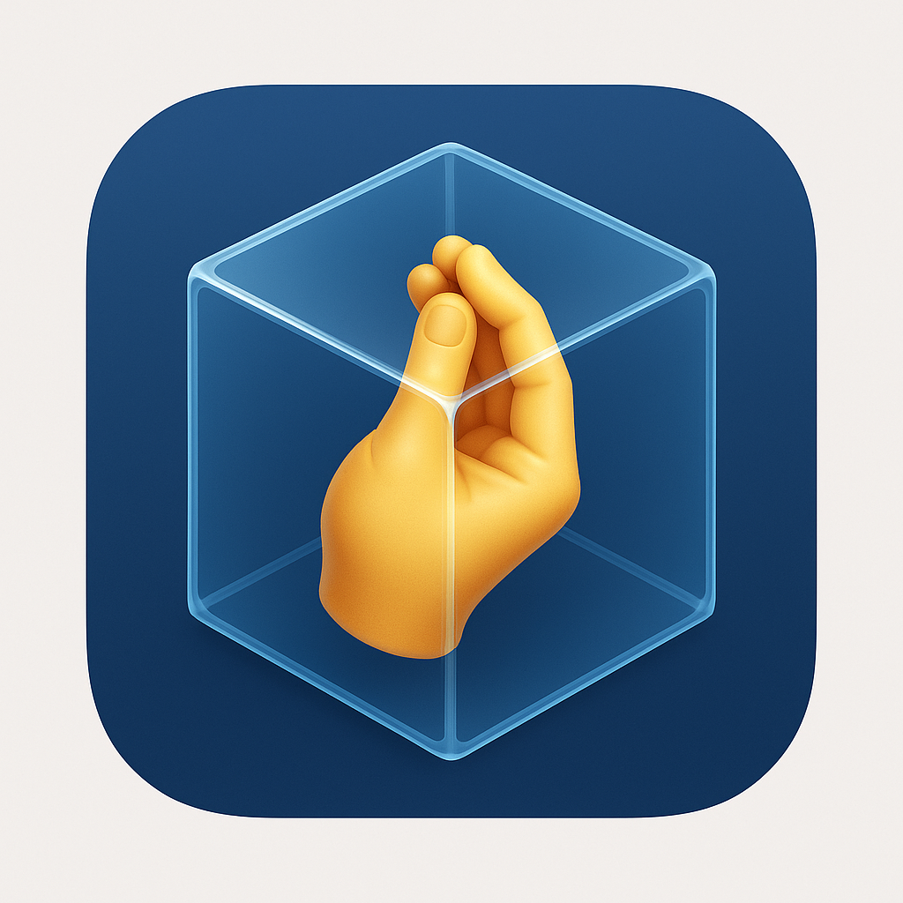
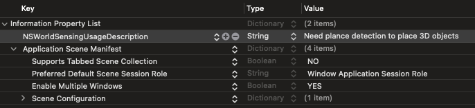

# SpatialGestures

[](https://swift.org)
[](https://developer.apple.com/visionos/)
[](https://swift.org/package-manager)
[](LICENSE)

SpatialGestures 是一个为 visionOS 应用程序中的 AR 实体提供简单而强大的手势处理能力的 Swift 包。

<p align="center">
  
</p>

## 功能

- **拖拽**：在空间中移动 3D 对象
- **旋转**：旋转 3D 对象（支持自定义旋转轴）
- **缩放**：调整 3D 对象大小
- **网格检测**：将对象放置在检测到的平面上，支持放置验证
- **手势回调**：监控手势事件并获取变换数据
- **调试模式**：在开发过程中获取详细的手势信息
- **可定制旋转**：指定旋转轴或完全禁用旋转

## 要求

- visionOS 1.0+
- Swift 5.0+
- Xcode 15.0+

## 安装

### Swift Package Manager

在 `Package.swift` 文件中添加依赖：

```swift
dependencies: [
    .package(url: "https://github.com/layzgunner/SpatialGestures.git", from: "1.0.0")
]
```

或在 Xcode 中添加：
1. 前往 File > Add Packages...
2. 输入包 URL：`https://github.com/layzgunner/SpatialGestures.git`
3. 选择版本要求并点击"Add Package"

## 使用方法

### 初始化 SpatialGestureManager

```swift
import SpatialGestures
import RealityKit
import SwiftUI

// 创建锚点
let referenceAnchor = Entity()

// 初始化手势管理器，启用网格检测和调试模式
let gestureManager = SpatialGestures.createManager(
    referenceAnchor: referenceAnchor,
    enableMeshDetection: true, // 启用网格检测用于放置
    showDebugVisualization: false, // 启用检测平面可视化（可选）
    isDebugEnabled: true, // 启用调试输出
    rotationAxis: .y // 可选：限制旋转轴为y轴
)

// 或直接初始化
let manager = SpatialGestureManager(
    referenceAnchor: referenceAnchor,
    enableMeshDetection: true,
    showDebugVisualization: false,
    isDebugEnabled: true,
    rotationAxis: .y
)

// 添加一个 3D 模型实体
let modelEntity = try! await Entity.load(named: "toy_robot")
gestureManager.addEntity(modelEntity, name: "robot")

// 设置变换回调
gestureManager.setTransformChangedCallback { (entityName, transform) in
    print("Entity \(entityName) transformed to: \(transform)")
}

// 设置手势回调（监控所有手势事件）
gestureManager.setGestureCallback { gestureInfo in
    switch gestureInfo.gestureType {
    case .drag:
        print("Dragging: \(gestureInfo.entityName)")
    case .rotate:
        print("Rotating: \(gestureInfo.entityName)")
    case .scale:
        if let magnification = gestureInfo.changeValue as? Float {
            print("Scaling: \(gestureInfo.entityName), magnification: \(magnification)")
        }
    case .gestureEnded:
        print("Gesture ended: \(gestureInfo.entityName)")
    case .placement:
        print("对象已放置: \(gestureInfo.entityName), 位置: \(gestureInfo.transform.translation)")
        // 放置时播放声音或触觉反馈
    }
}
```

### 启用网格检测用于放置

> **重要提示**：在Info.plist中添加必要的隐私描述：
> 
> `NSWorldSensingUsageDescription` = "需要进行平面检测以放置3D对象"
> 

```swift
// 启动网格检测
Task {
    await gestureManager.startMeshDetection(rootEntity: rootEntity)
}

// 将实体放置到检测到的平面上
let success = gestureManager.placeEntity(entity: modelEntity, entityName: "robot")

// 切换调试可视化
gestureManager.setMeshDetectionVisualization(true) // 显示网格可视化
gestureManager.setMeshDetectionVisualization(false) // 隐藏网格可视化

// 不再需要时停止网格检测
Task {
    await gestureManager.stopMeshDetection()
}
```

### 启用或禁用调试模式

```swift
// 启用调试模式
gestureManager.setDebugEnabled(true)

// 禁用调试模式
gestureManager.setDebugEnabled(false)

// 直接属性访问
gestureManager.isDebugEnabled = true
```

### 为视图添加手势支持

```swift
import SpatialGestures
import RealityKit
import SwiftUI

struct ImmersiveView: View {
    @StateObject private var gestureManager = SpatialGestures.createManager(
        referenceAnchor: Entity(),
        enableMeshDetection: true,
        showDebugVisualization: false,
        isDebugEnabled: true,
        rotationAxis: .y
    )
    var basicEntity = Entity()
    
    var body: some View {
        RealityView { content, attachments in
            content.add(basicEntity)

            Task {
                do {
                    let robotEntity = try await Entity(named: "Robot", in: realityKitContentBundle)
                    await gestureManager.addEntity(robotEntity, name: "Robot")
                    basicEntity.addChild(robotEntity)
                    
                    robotEntity.position = SIMD3<Float>(-0.2, 1.4, -0.6)
                    
                    // 设置手势回调
                    gestureManager.setGestureCallback { gestureInfo in
                        // 处理手势
                        if gestureInfo.gestureType == .placement {
                            // 当对象放置时播放声音或提供反馈
                            audioPlayer?.play()
                        }
                    }
                    
                    // 启动网格检测
                    Task {
                        await gestureManager.startMeshDetection(
                            rootEntity: basicEntity
                        )
                    }
                    
                } catch {
                    print("加载Robot实体失败")
                }
            }
        }
        .withSpatialGestures(manager: gestureManager)
        .onDisappear {
            Task {
                await gestureManager.stopMeshDetection()
                gestureManager.removeEntity(named: "Robot")
            }
        }
    }
}
```

### 使用单独的手势

如果只需要特定的手势功能：

```swift
// 仅使用拖拽和旋转（Y轴旋转）
myView.onDragAndRotate(manager: gestureManager)

// 指定旋转轴
myView.onDragAndRotate(
    manager: gestureManager,
    rotationAxis: .z  // 围绕Z轴旋转
)

// 仅拖拽手势（无旋转）
myView.onDragOnly(manager: gestureManager)

// 仅缩放手势
myView.onScale(manager: gestureManager)
```

## 管理实体

SpatialGestureManager 提供了多种方法来管理实体：

```swift
// 添加实体
let entityData = gestureManager.addEntity(newEntity, name: "newEntity")

// 获取实体
if let entity = gestureManager.getEntity(named: "robot") {
    // 使用找到的实体...
}

// 移除实体
gestureManager.removeEntity(named: "robot")

// 从交互实体找到主实体
let (entityData, entityName) = gestureManager.findEntityData(from: interactedEntity)
```

## 高效实体查找

SpatialGestures 使用多层缓存机制提供高效的实体查找：

1. **实体映射表**：所有注册的实体都存储在 O(1) 时间复杂度的哈希表中
2. **组件映射**：为实体和所有子实体创建映射关系，支持快速查找
3. **层级遍历**：对于复杂结构，可以沿着父级链向上查找
4. **后备系统**：对于特殊情况，提供完整的递归搜索作为后备方案

这种多层查找机制确保手势交互拥有最佳性能，即使在复杂场景中也能保持流畅的用户体验。

## 手势回调信息

手势回调提供了关于每个手势的详细信息：

```swift
gestureManager.setGestureCallback { info in
    // 手势类型
    let gestureType = info.gestureType
    
    // 实体名称
    let entityName = info.entityName
    
    // 当前变换
    let transform = info.transform
    
    // 初始变换（开始时）
    if let initialTransform = info.initialTransform {
        // 计算差异
        let translationDiff = transform.translation - initialTransform.translation
        print("位置偏移: \(translationDiff)")
    }
    
    // 特定变化值
    if let changeValue = info.changeValue {
        if info.gestureType == .scale {
            // 缩放系数
            let magnification = changeValue as! Float
            print("缩放系数: \(magnification)")
        } else if info.gestureType == .rotate {
            // 旋转角度
            let angle = changeValue as! Float
            print("旋转角度: \(angle)")
        }
    }
}
```

## 调试输出示例

当启用调试模式时，SpatialGestures 会打印详细的手势信息：

```
😀 SpatialGesture Debug: [Drag] Entity: robot position: SIMD3<Float>(0.1, 0.5, -0.2) offset: SIMD3<Float>(0.05, 0.0, -0.1)
😀 SpatialGesture Debug: [Rotate] Entity: robot rotation: SIMD3<Float>(0.0, 0.5, 0.0) angle: 0.5
😀 SpatialGesture Debug: [Magnify] Entity: robot scale: SIMD3<Float>(1.5, 1.5, 1.5) magnification: 1.5
😀 SpatialGesture Debug: [Gesture Ended] Entity: robot position: SIMD3<Float>(0.1, 0.5, -0.2) rotation: SIMD3<Float>(0.0, 0.5, 0.0) scale: SIMD3<Float>(1.5, 1.5, 1.5)
😀 SpatialGesture Debug: [Placement] Entity: robot position: SIMD3<Float>(0.1, 1.0, -0.5)
```

## 示例项目

查看我们的[示例项目](https://github.com/lazygunner/SpatialGesturesDemo)了解完整用法演示。

## 贡献

欢迎贡献！请随时提交 Pull Request。

## 许可证

SpatialGestures 在 MIT 许可下发布。详见 [LICENSE](LICENSE) 文件。 